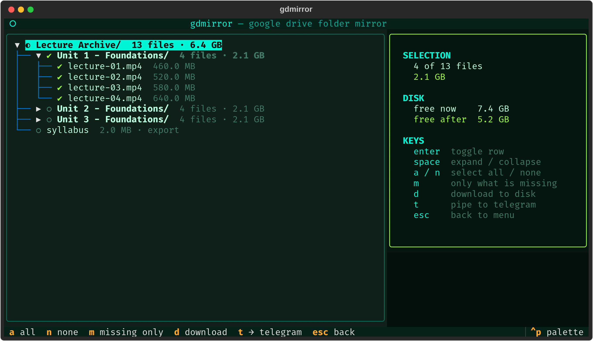
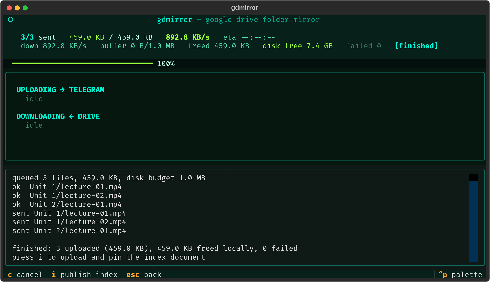
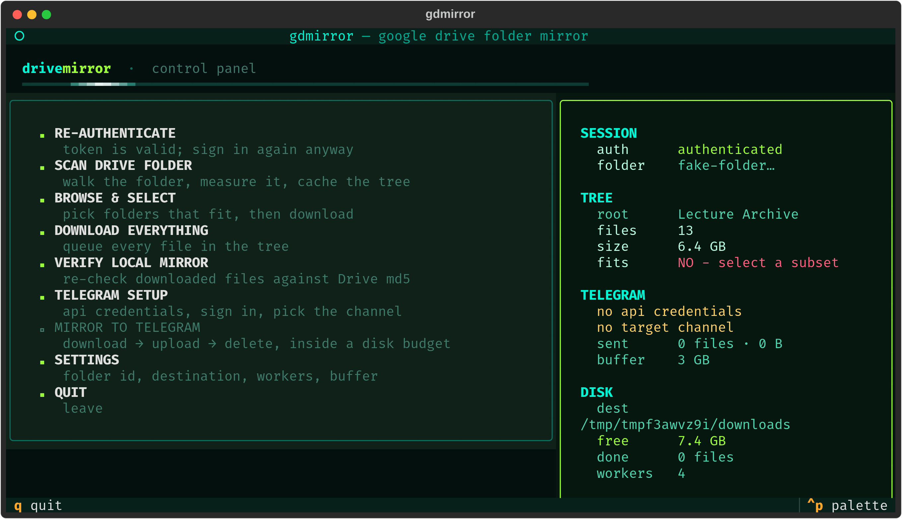

<div align="center">

```
 ██████╗ ██████╗ ███╗   ███╗██╗██████╗ ██████╗  ██████╗ ██████╗
██╔════╝ ██╔══██╗████╗ ████║██║██╔══██╗██╔══██╗██╔═══██╗██╔══██╗
██║  ███╗██║  ██║██╔████╔██║██║██████╔╝██████╔╝██║   ██║██████╔╝
██║   ██║██║  ██║██║╚██╔╝██║██║██╔══██╗██╔══██╗██║   ██║██╔══██╗
╚██████╔╝██████╔╝██║ ╚═╝ ██║██║██║  ██║██║  ██║╚██████╔╝██║  ██║
 ╚═════╝ ╚═════╝ ╚═╝     ╚═╝╚═╝╚═╝  ╚═╝╚═╝  ╚═╝ ╚═════╝ ╚═╝  ╚═╝
```

# google-drive-folder-mirror

**A terminal UI for mirroring a Google Drive folder to local disk, or relaying it to Telegram when the folder is larger than the disk.**

[](https://www.python.org/)
[](https://textual.textualize.io/)
[](#development)
[](LICENSE)

</div>

---

> [!IMPORTANT]
> **Acceptable use** — this tool transfers files you own, or that have been
> shared with you with download permission. Redistributing licensed or paid
> material is not a supported use case and remains your responsibility.

## Overview

Downloading a large shared Drive folder is awkward in the browser: no resume, no
integrity check, and no way to see what will fit before you start. Google's own
tooling is either a full-sync client or a raw API.

`gdmirror` is a single terminal application for that job. It scans the folder,
shows it as a tree with live size-versus-free-space figures, and downloads what
you select in parallel with resume and checksum verification.

When the folder is larger than the available disk, it can relay instead of
storing: each file is downloaded, uploaded to a Telegram channel, and deleted
locally before the next one begins. A folder of any size then moves through a
fixed, configurable amount of disk.

All operations are resumable. An interrupted run loses at most the file in
flight.

## Features

- **Interactive tree browser** with tri-state selection and a running projection
  of free space after the selected download.
- **Parallel downloads** with byte-range resume, per-file MD5 verification, and
  retry of failed files.
- **Telegram relay** that streams a folder through a bounded disk buffer, so the
  folder size is not limited by the disk size.
- **Crash-safe by design.** Partial downloads resume; completed files left by a
  killed run are adopted after verification instead of being re-fetched.
- **Faithful structure.** The Drive hierarchy is reproduced on disk, with name
  sanitising and collision handling.
- **Shared drives, shortcuts and Google-native documents** are all handled;
  Docs, Sheets, Slides and Drawings are exported to open formats.
- **No daemon, no database, no config file to hand-write.** State lives in a few
  JSON files next to the application.

## Screenshots

**Browse and select** — the folder as a tree, with the selection measured against free disk space.



**Mirror to Telegram** — download, upload and delete running inside a fixed disk buffer.



**Menu** — every action, with a live status panel.



## Requirements

| | |
|---|---|
| Python | 3.11 or newer |
| Package manager | [uv](https://docs.astral.sh/uv/) (recommended) or pip |
| Google | An OAuth **desktop** client (`credential.json`) |
| Telegram | An `api_id` / `api_hash` pair — only for the relay feature |

## Installation

```bash
git clone https://github.com/<you>/google-drive-folder-mirror
cd google-drive-folder-mirror
uv sync
```

## Quick start

1. **Create a Google OAuth client.** In the [Google Cloud
   console](https://console.cloud.google.com/), enable the Drive API, then
   create an OAuth client of type **Desktop app**. Download the JSON and save it
   as `credential.json` in the project directory.

   A service account will not work: it cannot see folders shared with a personal
   account.

   If the OAuth app is in *Testing* mode, add your own Google account under
   **Audience → Test users**, otherwise consent is refused.

2. **Launch the application.**

   ```bash
   uv run gdmirror
   ```

3. **Authenticate.** Select `AUTHENTICATE`. A browser window opens for Google
   consent; the resulting token is cached locally.

4. **Set the folder.** Open `SETTINGS` and paste the folder id — the last
   segment of the folder URL:

   ```
   https://drive.google.com/drive/folders/<FOLDER_ID>
   ```

5. **Scan, then browse.** `SCAN DRIVE FOLDER` walks the folder and caches the
   tree. `BROWSE & SELECT` shows it, with the size of your selection measured
   against free disk space.

6. **Download** the selection with `d`. To relay to Telegram instead, complete
   the Telegram setup below, then use `t` here or `MIRROR TO TELEGRAM` from the
   menu.

## Usage

The application is a single TUI; there are no subcommands. Command-line flags
(`--folder-id`, `--dest`, `--workers`, `--no-splash`) only pre-fill settings.

### Screens

| Screen | Purpose |
|---|---|
| Menu | Entry point, with a live status panel. Unavailable actions state what is missing. |
| Auth | Google OAuth via a loopback redirect, with the URL shown if no browser opens. |
| Scan | Walks the folder and caches the tree for instant restarts. |
| Browse | Tree view with tri-state selection and free-space projection. |
| Download | Progress per file and overall, transfer rate, ETA, cancel and retry. |
| Verify | Re-hashes the local copy against Drive checksums and requeues bad files. |
| Telegram | API credentials, sign-in, and channel selection or creation. |
| Mirror to Telegram | Live view of the download → upload → delete cycle and the disk buffer. |
| Settings | Folder, destination, workers, verification, buffer size, throttle. |

### Key bindings

Each screen lists its own keys in the footer.

| Screen | Keys |
|---|---|
| Menu | `a` auth · `s` scan · `b` browse · `v` verify · `t` telegram setup · `p` mirror to telegram · `,` settings · `q` quit |
| Browse | `enter` toggle · `space` expand · `a` select all · `n` select none · `m` select missing only · `d` download · `t` mirror selection to telegram · `esc` back |
| Download | `c` cancel · `r` retry failed · `esc` back |
| Mirror to Telegram | `c` cancel · `i` publish index · `esc` back |

## Telegram relay

Use this when the folder does not fit on disk. Files pass through a bounded
buffer:

```
Drive ──download──▶ buffer/ ──upload──▶ Telegram ──▶ local copy deleted
                       ▲                    │
                       └─ next file starts when space is freed
```

### Setup

1. Obtain an `api_id` and `api_hash` from
   [my.telegram.org](https://my.telegram.org) → *API development tools*.
2. Enter them in the Telegram screen. They are stored in `telegram.json` with
   mode `600`.
3. Sign in with your phone number, the login code, and your two-factor password
   if one is set. These are passed directly to Telegram; only the session file
   is persisted, also mode `600`.
4. Select an existing channel, or have the application create a private one.

> **Why a user account rather than a bot?** The Telegram Bot API limits uploads
> to 50 MB. A user account via MTProto allows 2 GB per file.

### Behaviour

- Files are uploaded in folder order, so a flat channel reads in the same order
  as the source tree.
- Each caption carries the file name, its folder path and its size.
- Pressing `i` publishes a navigable index: a pinned root post links to each
  top-level section, larger sections link to their subfolders, and leaves list
  the files — all as ordinary in-channel posts with back-links, so the channel
  is browsable inside Telegram rather than by opening a file. It adapts to size
  (one post when it all fits, nested posts when it does not), and re-publishing
  replaces the previous index instead of duplicating it. `manifest.json` holds
  the same path→link mapping locally.
- A local file is deleted only after Telegram returns a message id and the size
  it reports matches the file sent.
- Upload records are written to disk before the local copy is removed, so an
  interrupted run cannot leave an unreferenced file in the channel.
- Download workers block when the buffer is full, so download throughput
  automatically matches upload throughput.
- Bytes belonging to failed transfers stay charged against the buffer, so
  repeated failures cannot exceed the configured size. They are reported as
  *stranded*.
- `FLOOD_WAIT` responses are waited out with a visible countdown. Other errors
  are retried with exponential backoff.

## Configuration

Settings are edited in the application and stored as JSON alongside it.

| File | Contents |
|---|---|
| `settings.json` | Folder id, destination, workers, verification |
| `telegram.json` | Telegram credentials and target channel (mode `600`) |
| `token.json` | Cached Google OAuth token (mode `600`) |
| `telegram.session` | Telethon session (mode `600`) |
| `tree.json` | Cached folder scan |
| `state.json` | Which files are on disk, and which reached Telegram |
| `manifest.json` | Drive path → Telegram message link |

All are excluded from version control.

> [!WARNING]
> `token.json` grants read access to your entire Drive, and `telegram.session`
> is an authenticated Telegram session for your account. Treat both as
> credentials: never commit or share them.

### Environment variables

| Variable | Effect |
|---|---|
| `GDM_FOLDER_ID` | Default Drive folder id |
| `GDM_DEST` | Default destination directory |
| `GDM_WORKERS` | Default parallel transfer count |
| `GDM_CREDENTIALS` | Path to the OAuth client JSON |
| `GDM_TOKEN` | Path to the cached token |
| `GDM_SHOTS` | Where test screenshots are written |

## Limitations

- Telegram caps uploads at 2 GB per file (4 GB with Premium). Larger files are
  reported as failures rather than being split.
- Upload throughput is bound by your connection. Large relays are multi-session
  operations; resumption is designed for that.
- An interrupted upload restarts that file from the beginning. Telegram offers
  no cross-process upload resumption.
- Google-native documents are exported, so their size is unknown before
  transfer; space estimates use a placeholder for them.
- Drive may rate-limit sustained bulk downloads of shared files. The client
  backs off, but a large transfer can extend across days.

## Development

### Tests

```bash
for t in smoke download pipeline index; do uv run python tests/test_$t.py || break; done
```

The suite runs offline and requires no Google or Telegram account. The Drive
side is a local HTTP server supporting range requests; the Telegram side is a
recording double.

| Suite | Scope |
|---|---|
| `test_smoke.py` | Screens driven headlessly end to end, banner geometry, selection logic; writes SVG screenshots |
| `test_download.py` | Fresh download, skip on rerun, range resume, checksum rejection, cancel and resume |
| `test_pipeline.py` | Upload ordering, deletion only after confirmation, buffer limits, queue starvation, stranded bytes, adoption, persistence |
| `test_index.py` | Index tree build, every file linked once, post size limits, pagination, nesting and back-links, publisher ordering and stale cleanup |

### Project layout

```
gdmirror/
  banner.py      block-letter wordmark rendering
  auth.py        Google OAuth via loopback redirect
  drive.py       folder model, recursive walk, tree cache
  download.py    parallel resumable transfers and verification
  tg.py          Telethon client wrapped in a blocking interface
  pipeline.py    download → upload → delete relay
  state.py       what is on disk, and what reached Telegram
  settings.py    persisted user settings
  tgconfig.py    Telegram credentials and target channel
  config.py      paths, scopes, export formats, safety margins
  util.py        sanitising, hashing, formatting
  ui/            one module per screen
tests/
  fakedrive.py   local stand-in for the Drive API
```

## License

[MIT](LICENSE) — do what you like with it, keep the copyright notice, no warranty.
